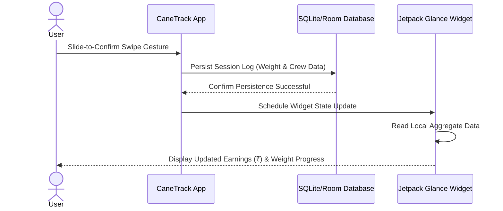

# CaneTrack


## Short Description
A high-fidelity, highly-animated Android utility engineered for real-time sugarcane harvest tracking, crew weight logging, and comprehensive earnings diaries. It features an interactive, glanceable Home Screen Widget built with Jetpack Glance for immediate access in field operations.

## Project Introduction
CaneTrack is a premium, outdoor-optimized utility designed to replace traditional manual sugarcane harvest logging. Engineered for outdoor clarity with the high-contrast Obsidian Forest design system, the app minimizes glare and eye strain under direct sunlight. The core user flow utilizes a custom-drawn canvas circular progress gauge to monitor daily targets, alongside dynamic animations like rolling odometer numbers for weight feedback. To prevent accidental data entries in rugged environments, users confirm transactions using a secure slide-to-confirm gesture, which persists data locally and immediately schedules updates to the Glance home screen widget.



## Tech Stack and Core Engineering

* **Technologies:** Kotlin, Jetpack Compose, Jetpack Glance, Material 3, Android SDK 35, Java 11.
* **Engineering Methods:** Custom Canvas drawing (for progress gauges), gesture-based interaction models (slide-to-confirm), spring animation physics (`bounceClick`), decoupled rolling digit display rendering (`AnimatedWeightText`), and asynchronous glanceable widgets configured with fallback XML layouts.

## Getting Started

### Prerequisites
* JDK 17
* Android Studio Ladybug or later
* Android SDK (API Level 35)

### Installation and Usage

```bash
# Clone the repository
git clone https://github.com/username/CaneTrack.git

# Navigate into the project directory
cd CaneTrack

# Build and generate the debug APK
./gradlew assembleDebug
```

For Windows environments using PowerShell:
```powershell
$env:JAVA_HOME="E:\AndroidStudio\jbr"
.\gradlew.bat assembleDebug
```

For Windows using Command Prompt:
```cmd
set JAVA_HOME="E:\AndroidStudio\jbr"
gradlew.bat assembleDebug
```

## Key Features

* **Premium Obsidian Forest System:** Sleek slate backgrounds (`#070A13`) engineered for outdoor high-glare environments.
* **Circular Progress Canvas Gauge:** Custom canvas progress arc mapping performance sweeps against a 5,000 kg target.
* **Slide-to-Confirm Swipe:** Safety-first drag-and-swipe gesture capsule replacing tap triggers to eliminate accidental submissions.
* **Odometer Weight Readouts:** Independent column scrolling (`AnimatedWeightText`) for weight changes to improve dynamic numeric visibility.
* **Jetpack Glance Home Screen Widget:** Displays real-time earnings (`₹`) and session weight progress directly on the device home screen.

## Directory Structure

```text
CaneTrack/
├── app/
│   ├── src/
│   │   ├── main/
│   │   │   ├── java/         # Kotlin/Java codebase
│   │   │   └── res/          # XML Layout resources (widget fallback layout)
│   │   └── build.gradle      # App-level dependencies (Glance 1.1.0)
│   └── build/
├── gradlew.bat
└── build.gradle              # Project-level configuration
```

## Configuration
No special environment secrets are required. Ensure your SDK path is configured in the root-level `local.properties` file:
```properties
sdk.dir=/path/to/your/android/sdk
```

## Contributing
Contributions to extend utility features or optimize spring transitions are welcome. Please open an issue to discuss design changes or submit a Pull Request directly.

## License

This project is licensed under the MIT License.
