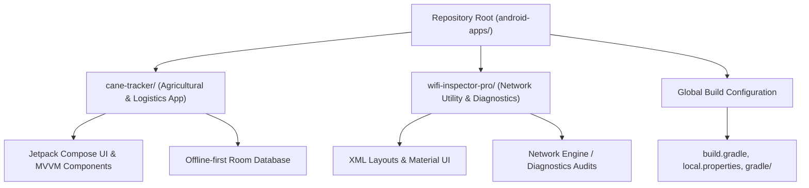

# Android Applications Portfolio


## Short Description
A centralized repository hosting production-grade Android applications built with Clean Architecture, Modern Android Development (MAD) toolsets, and robust local-first patterns. The suite features specialized solutions for agricultural logistics weight tracking and network security auditing.

## Project Introduction
This portfolio showcases mobile applications engineered to demonstrate clean, maintainable, and testable design patterns. The projects solve distinct, real-world operational challenges: Cane Tracker automates harvest loading logistics by dynamically computing net crop weight and mitigating manual entry errors, while WiFi Inspector Pro provides network diagnostic telemetry and connection auditing. By separating business logic from platform components using MVVM, repository patterns, and local storage, these applications maintain performance, decoupled testing capability, and complete offline resilience.



## Tech Stack and Core Engineering

* **Technologies:** Kotlin, Java, Jetpack Compose, Material 3, XML Layouts, Room Database, SQLite, Shared Preferences, Retrofit, OkHttp, LiveData, ViewModels.
* **Engineering Methods:** MVVM (Model-View-ViewModel) architectural pattern, Clean Architecture principles, offline-first data caching strategies, repository abstraction layer, and automated real-time logic for weight subtraction.

## Getting Started

### Prerequisites
* JDK 17
* Android Studio Ladybug or later
* Android SDK Platform 34 (Android 14.0)

### Installation and Usage

```bash
# Clone the repository
git clone https://github.com/username/android-apps-portfolio.git

# Navigate into the project directory
cd android-apps-portfolio

# Build debug APKs for all projects
./gradlew assembleDebug
```

## Key Features

* **Automated Logistics Computation:** Calculates net harvest weight automatically by subtracting worker body weight from gross weight in real-time.
* **Network & Security Auditing:** Performs real-time wireless signal monitoring, active IP address discovery, and security scans to optimize performance.
* **Offline-First Persistence:** Implements Room Database for secure local transaction caching, ensuring operation in remote regions.
* **Modern UI/UX:** Employs declarative Jetpack Compose interfaces combined with XML fallback layouts to maintain support across legacy systems.

## Directory Structure

```text
android-apps/
├── cane-tracker/         # Agricultural loading & worker weight tracker
├── wifi-inspector-pro/   # Network diagnostic and security tool
└── README.md             # Repository documentation
```

## Configuration
To compile the applications, define your local Android SDK directory in a `local.properties` file at the root level:

```properties
sdk.dir=/path/to/your/android/sdk
```

## Contributing
Contributions to extend capabilities or optimize the existing applications are welcome. Please open an issue to outline suggested changes or submit a structured Pull Request adhering to the repository's MVVM and Clean Architecture patterns.

## License

This project is licensed under the MIT License.
