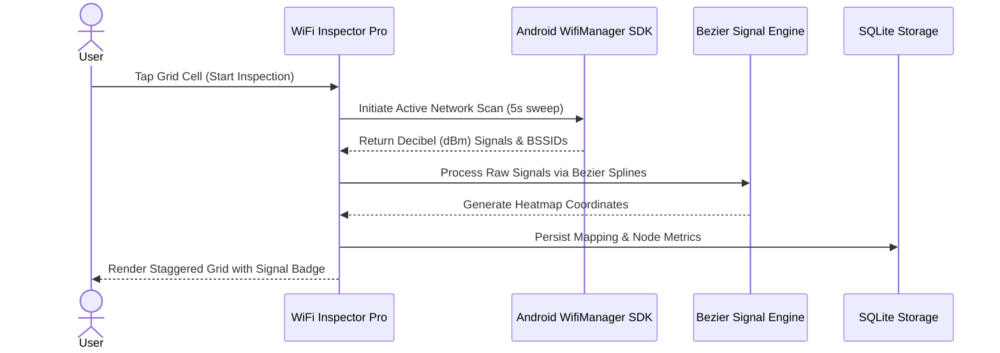

# WiFi Inspector Pro

[](https://developer.android.com)
[](https://kotlinlang.org)
[](https://developer.android.com/jetpack/compose)
[](https://material.io/design)
[](https://opensource.org/licenses/MIT)

## Short Description
A high-fidelity wireless network diagnostics and space-mapping utility for Android. Built with a unified Material 3 design system, it enables users to visualize wireless coverage through real-time signal analysis and dynamic heatmaps.

## Project Introduction
WiFi Inspector Pro is a specialized diagnostic utility engineered to monitor, map, and audit wireless network coverage. The application utilizes a "Modern Monolith" design aesthetic, utilizing adaptive light/dark themes and spring-based haptic-like micro-interactions. The core scanning system drives a real-time signal capture engine that plots decibel metrics on cubic Bezier curves, while users map physical spaces using customizable grid matrices. The application tracks signal attenuation, identifies dead zones, and structures historical audit logs into comprehensive spatial heatmaps.



## Tech Stack and Core Engineering

* **Technologies:** Kotlin, Java, Jetpack Compose, Material 3, Android SDK, SQLite, Retrofit, OkHttp, LiveData, ViewModels.
* **Engineering Methods:** Custom Bezier curve drawing (`SignalGraph`), adaptive theme synchronization, spring-based scale feedback modifiers (`Modifier.bounceClick`), staggered index loading animation, bilinear heatmap processing algorithms, and location permissions modeling.

## Getting Started

### Prerequisites
* JDK 17
* Android Studio Ladybug or later
* Android SDK (API Level 34 or higher)

### Installation and Usage

```bash
# Clone the repository
git clone https://github.com/arm-x-Dev/Android-Apps.git

# Navigate into the project directory
cd Android-Apps/WiFiInspectorPro

# Compile and package the application debug build
./gradlew assembleDebug
```

## Key Features

* **Unified Indigo Theme:** Integrated "Modern Monolith" design using Electric Indigo (`#6366F1`) and Royal Indigo (`#4F46E5`) styles.
* **System-Aware Adaptation:** Dynamic synchronization with light/dark device theme configurations, including top and bottom status/navigation bars.
* **Spring-Based Haptics:** Custom responsive scaling (`Modifier.bounceClick`) on input cells, grid buttons, and navigation elements.
* **Bilinear Heatmap Archives:** Comprehensive scan logs visualizing attenuation boundaries and coverage shifts.
* **High-Fidelity Diagnostics:** Real-time signal graphing mapped via cubic Bezier splines alongside continuous sonar radar overlays.

## Directory Structure

```text
WiFiInspectorPro/
├── app/
│   ├── src/
│   │   ├── main/
│   │   │   ├── java/         # Code files (Kotlin/Java)
│   │   │   └── res/          # Layout resources and Material themes
│   │   └── build.gradle      # App-level dependencies
│   └── build/
├── gradle/
├── gradlew.bat
└── build.gradle              # Project-level configuration
```

## Configuration
Before running inspections, ensure location services are enabled on the target device. Compile-time configurations require the local SDK path defined inside `local.properties`:

```properties
sdk.dir=/path/to/your/android/sdk
```

## Contributing
Contributions for expanding diagnostic engines or improving rendering algorithms are welcome. Open an issue to discuss design enhancements or submit a Pull Request.

## License

This project is licensed under the MIT License.
